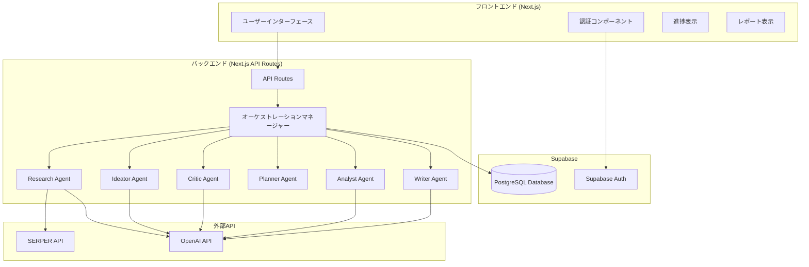
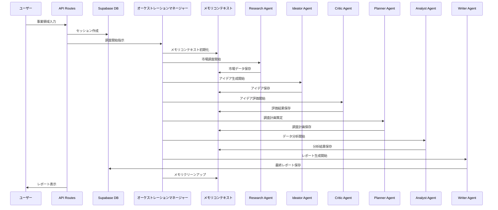

# ビジネス提案エージェント設計書（MVP版）

## 概要

ビジネス提案エージェントは、三菱地所の新事業開発担当者向けのAIシステムです。このシステムは、事業アイデアの発掘から評価、企画まで一貫してサポートします。Next.js（フロントエンド）、Supabase（データベース・認証）を基盤とし、複数の専門エージェントが連携して事業提案レポートを生成します。

システムの特徴：
- Next.jsによるシンプルなWebアプリケーション
- Supabaseによる認証とデータ管理
- ユーザー入力に基づく調査計画策定
- 三菱地所のケイパビリティとの親和性重視
- 15分以内での処理
- 経営層向けのレポート生成
- 全事業領域対応（1000億円以上の市場規模）
- 営業利益10億円規模の事業提案生成

## Architecture

### システム全体アーキテクチャ（MVP版）



### データフロー（MVP版）



## コンポーネントとインターフェース

### 1. Next.js フロントエンド

**責任:**
- ユーザーインターフェースの提供
- 進捗表示
- 認証状態管理
- レポートのWeb画面での表示と再表示

**主要コンポーネント:**
```typescript
// app/page.tsx - メインページ
// app/login/page.tsx - ログインページ
// app/components/InputForm.tsx - 事業領域入力フォーム
// app/components/ProgressTracker.tsx - 進捗表示
// app/components/ReportViewer.tsx - レポート表示
// app/components/ReportHistory.tsx - 過去レポートの履歴表示
// app/hooks/useSupabase.ts - Supabaseクライアント
```

### 2. オーケストレーションマネージャー (Next.js App Router API Routes)

**責任:**
- エージェント間の実行順序制御
- シンプルデータ管理（メモリ + Supabase）
- 基本的なエラーハンドリング
- 処理時間監視（15分制限）

**シンプルデータ管理の実装:**
```typescript
// lib/orchestration-manager.ts
interface SessionContext {
  sessionId: string;
  userInput: string | null;
  marketData?: MarketData;
  businessIdeas?: BusinessIdea[];
  selectedIdea?: BusinessIdea;
  analysisResults?: AnalysisResults;
}

class OrchestrationManager {
  private sessionContexts: Map<string, SessionContext> = new Map();
  
  async executeWorkflow(userInput: string | null, sessionId: string): Promise<void> {
    // セッション初期化（Supabaseに保存）
    await this.initializeSession(sessionId, userInput);
    
    // メモリベースのコンテキスト作成
    const context: SessionContext = {
      sessionId,
      userInput
    };
    this.sessionContexts.set(sessionId, context);
    
    try {
      // エージェント実行（メモリベース受け渡し）
      context.marketData = await this.researchAgent.collect(userInput, context);
      context.businessIdeas = await this.ideatorAgent.generate(context.marketData, context);
      context.selectedIdea = await this.criticAgent.evaluate(context.businessIdeas, context);
      context.analysisResults = await this.analystAgent.analyze(context.selectedIdea, context);
      
      // 最終レポート生成と保存
      const finalReport = await this.writerAgent.generateReport(context.analysisResults, context);
      await this.saveFinalReport(sessionId, finalReport);
      
    } finally {
      // メモリクリーンアップ
      this.sessionContexts.delete(sessionId);
    }
  }
  
  private async saveFinalReport(sessionId: string, report: any): Promise<void> {
    // 最終レポートの保存
  }
  
  async handleAgentError(agentId: string, error: Error, sessionId: string): Promise<void> {
    // 基本的なエラーハンドリング
  }
}
```

**インターフェース:**
```typescript
// app/api/workflow/start/route.ts
export async function POST(request: Request) {
  const { user_input, session_id } = await request.json();
  // ワークフロー開始処理
  return Response.json({ success: true });
}
```

### 3. 情報収集エージェント (App Router API Routes)

**責任:**
- ユーザー入力の解析と調査計画策定
- 市場・技術・トレンド情報の収集
- 三菱地所ケイパビリティとの親和性評価
- メモリコンテキストへのデータ保存

**インターフェース:**
```typescript
// lib/agents/information-collection-agent.ts
class InformationCollectionAgent {
  async collect(userInput: string | null, context: SessionContext): Promise<MarketData> {
    const plan = userInput 
      ? await this.createCustomResearchPlan(userInput, context)
      : await this.createDefaultResearchPlan(context);
    
    const marketData = await this.executeResearch(plan, context);
    const affinityScores = await this.evaluateCapabilityAffinity(marketData, context);
    
    return {
      ...marketData,
      capability_affinity: affinityScores
    };
  }
  
  private async createCustomResearchPlan(userInput: string, context: SessionContext): Promise<ResearchPlan>
  private async createDefaultResearchPlan(context: SessionContext): Promise<ResearchPlan> // 全領域対応の12カテゴリ調査
  private async executeResearch(plan: ResearchPlan, context: SessionContext): Promise<MarketData>
  private async evaluateCapabilityAffinity(data: MarketData, context: SessionContext): Promise<AffinityScore>
}
```

**処理フロー（MVP版）:**
1. ユーザー入力の有無を判定
2. 入力ありの場合：調査計画策定 → 関連情報収集
3. 入力なしの場合：全領域対応の12カテゴリ調査
4. 1000億円以上の市場規模を持つ事業機会の特定
5. 三菱地所ケイパビリティとの親和性評価
6. 結果をメモリコンテキストに保存（高速）

### 4. アイディエーションエージェント (App Router API Routes)

**責任:**
- 収集情報に基づく事業アイデア生成（制約なく自由にアイディエーション）
- 三菱地所ケイパビリティを活用したビジネス加速シナリオの作成
- 「こういうケイパビリティを活かしてこのビジネスを加速できる」というストーリー生成
- メモリコンテキストからのデータ取得

**注意事項:**
- ケイパビリティとの親和性評価・スコアリングはCriticエージェントで実施
- この段階では詳細な財務計算は不要

**インターフェース:**
```typescript
// lib/agents/ideation-agent.ts
class IdeationAgent {
  async generate(marketData: MarketData, context: SessionContext): Promise<BusinessIdea[]> {
    // 制約なく自由にアイディエーション
    const ideas = await this.generateBusinessIdeas(marketData, context);
    
    // ケイパビリティ活用シナリオの作成
    const enhancedIdeas = await this.enhanceWithCapabilityScenarios(ideas, context);
    
    return enhancedIdeas;
  }
  
  private async generateBusinessIdeas(marketData: MarketData, context: SessionContext): Promise<BusinessIdea[]>
  private async enhanceWithCapabilityScenarios(ideas: BusinessIdea[], context: SessionContext): Promise<BusinessIdea[]>
}
```

### 5. 評価エージェント (App Router API Routes)

**責任:**
- 6軸評価（独創性・実現可能性・市場性・シナジー適合性・競合優位性・リスクバランス）
- **三菱地所ケイパビリティとの親和性評価**（アイディエーションエージェントでは評価しない）
- 営業利益10億円達成可能性の数値化
- 1000億円以上の市場規模での事業性評価
- 最優先アイデアの選定
- 評価結果のメモリコンテキスト保存

**インターフェース:**
```typescript
// lib/agents/evaluation-agent.ts
class EvaluationAgent {
  async evaluate(ideas: BusinessIdea[], context: SessionContext): Promise<EvaluationResult[]> {
    const evaluations = await this.evaluateSixDimensions(ideas, context);
    const profitProjections = await this.calculateProfitPotentials(ideas, context);
    const selectedIdea = await this.selectTopIdea(evaluations, context);
    
    return evaluations.map(eval => ({
      ...eval,
      profit_projection: profitProjections.find(p => p.idea_id === eval.idea_id),
      is_selected: eval.idea_id === selectedIdea.id
    }));
  }
  
  private async evaluateSixDimensions(ideas: BusinessIdea[], context: SessionContext): Promise<EvaluationResult[]>
  private async calculateProfitPotentials(ideas: BusinessIdea[], context: SessionContext): Promise<ProfitProjection[]>
  private async selectTopIdea(evaluations: EvaluationResult[], context: SessionContext): Promise<BusinessIdea>
}
```

**評価基準:**
- 各軸10点満点での評価
- 最低品質スコア6.0以上
- 営業利益10億円達成可能性（5-10年）
- 1000億円以上の市場規模への対応
- 三菱地所ケイパビリティ活用度

**データ保存戦略:**
- 評価結果はメモリで高速処理
- 最終レポートのみSupabaseに保存

### 6. 調査計画エージェント (App Router API Routes)

**責任:**
- 選定アイデアの詳細調査計画策定
- 調査項目の優先度設定
- 調査実行順序の決定
- 調査計画のメモリコンテキスト保存

**インターフェース:**
```typescript
// lib/agents/research-planning-agent.ts
class ResearchPlanningAgent {
  async createPlan(selectedIdea: BusinessIdea, context: SessionContext): Promise<ResearchPlan> {
    const detailedPlan = await this.createDetailedPlan(selectedIdea, context);
    const prioritizedPlan = await this.setResearchPriorities(detailedPlan, context);
    const executionPlan = await this.defineExecutionOrder(prioritizedPlan, context);
    
    return executionPlan;
  }
  
  private async createDetailedPlan(selectedIdea: BusinessIdea, context: SessionContext): Promise<DetailedResearchPlan>
  private async setResearchPriorities(plan: DetailedResearchPlan, context: SessionContext): Promise<PrioritizedPlan>
  private async defineExecutionOrder(plan: PrioritizedPlan, context: SessionContext): Promise<ExecutionPlan>
}
```

### 7. 調査実行エージェント (App Router API Routes)

**責任:**
- SERPER APIを活用した市場規模調査
- 競合他社の事業戦略・財務分析
- 技術・規制動向の評価
- 調査結果のメモリコンテキスト保存

**インターフェース:**
```typescript
// lib/agents/research-execution-agent.ts
class ResearchExecutionAgent {
  async execute(plan: ResearchPlan, context: SessionContext): Promise<DetailedResearchData> {
    const marketResearch = await this.executeMarketResearch(plan, context);
    const competitorAnalysis = await this.analyzeCompetitors(plan, context);
    const techRegulationAnalysis = await this.evaluateTechRegulations(plan, context);
    
    return {
      market_research: marketResearch,
      competitor_analysis: competitorAnalysis,
      tech_regulation_analysis: techRegulationAnalysis
    };
  }
  
  private async executeMarketResearch(plan: ResearchPlan, context: SessionContext): Promise<MarketResearchResult>
  private async analyzeCompetitors(plan: ResearchPlan, context: SessionContext): Promise<CompetitorAnalysis>
  private async evaluateTechRegulations(plan: ResearchPlan, context: SessionContext): Promise<TechRegulationAnalysis>
}
```

### 8. レポート生成エージェント (App Router API Routes)

**責任:**
- 経営層向け事業提案レポートの生成
- 7つの定義された項目に基づくレポート構成
- 事業概要から検証計画まで包括的な提案書作成
- 最終レポートのSupabase完全保存

**インターフェース:**
```typescript
// lib/agents/report-generation-agent.ts
class ReportGenerationAgent {
  async generateReport(analysisResults: AnalysisResults, context: SessionContext): Promise<BusinessProposalReport> {
    const selectedIdea = context.selectedIdea;
    
    const businessOverview = await this.createBusinessOverview(selectedIdea, analysisResults, context);
    const targetAnalysis = await this.analyzeTargetAndChallenges(selectedIdea, analysisResults, context);
    const solutionHypothesis = await this.developSolutionHypothesis(selectedIdea, analysisResults, context);
    const marketAnalysis = await this.analyzeMarketAndCompetitors(analysisResults, context);
    const mitsubishiSignificance = await this.defineMitsubishiSignificance(selectedIdea, context);
    const validationPlan = await this.createValidationPlan(selectedIdea, context);
    const riskAssessment = await this.assessBusinessRisks(selectedIdea, analysisResults, context);
    
    const finalReport = {
      business_overview: businessOverview,
      target_analysis: targetAnalysis,
      solution_hypothesis: solutionHypothesis,
      market_analysis: marketAnalysis,
      mitsubishi_significance: mitsubishiSignificance,
      validation_plan: validationPlan,
      risk_assessment: riskAssessment
    };
    
    return finalReport;
  }
  
  private async createBusinessOverview(idea: BusinessIdea, analysis: AnalysisResults, context: SessionContext): Promise<BusinessOverview>
  private async analyzeTargetAndChallenges(idea: BusinessIdea, analysis: AnalysisResults, context: SessionContext): Promise<TargetAnalysis>
  private async developSolutionHypothesis(idea: BusinessIdea, analysis: AnalysisResults, context: SessionContext): Promise<SolutionHypothesis>
  private async analyzeMarketAndCompetitors(analysis: AnalysisResults, context: SessionContext): Promise<MarketAnalysis>
  private async defineMitsubishiSignificance(idea: BusinessIdea, context: SessionContext): Promise<BusinessSignificance>
  private async createValidationPlan(idea: BusinessIdea, context: SessionContext): Promise<ValidationPlan>
  private async assessBusinessRisks(idea: BusinessIdea, analysis: AnalysisResults, context: SessionContext): Promise<RiskAssessment>
}
```

## Data Models

### シンプルデータ管理方式（MVP版）

本システムでは、処理速度と要件適合性を両立するため、**シンプルデータ管理方式**を採用します：

**メモリベース（高速処理）:**
- エージェント間の中間データ受け渡し
- 一時的な市場調査データ
- 処理中の分析結果

**Supabaseベース（永続化・履歴管理）:**
- セッション情報
- 最終レポート

### Supabaseデータベーススキーマ（MVP版）

```sql
-- ユーザー拡張情報
CREATE TABLE user_profiles (
  id UUID PRIMARY KEY REFERENCES auth.users(id),
  name TEXT NOT NULL,
  department TEXT,
  created_at TIMESTAMP WITH TIME ZONE DEFAULT NOW(),
  updated_at TIMESTAMP WITH TIME ZONE DEFAULT NOW()
);

-- セッション管理
CREATE TABLE sessions (
  id UUID PRIMARY KEY DEFAULT gen_random_uuid(),
  user_id UUID REFERENCES auth.users(id),
  user_input TEXT,
  status TEXT DEFAULT 'started' CHECK (status IN ('started', 'in_progress', 'completed', 'error')),
  created_at TIMESTAMP WITH TIME ZONE DEFAULT NOW(),
  updated_at TIMESTAMP WITH TIME ZONE DEFAULT NOW()
);

-- ビジネスアイデア
CREATE TABLE business_ideas (
  id UUID PRIMARY KEY DEFAULT gen_random_uuid(),
  session_id UUID REFERENCES sessions(id) ON DELETE CASCADE,
  title TEXT NOT NULL,
  description TEXT NOT NULL,
  target_market TEXT,
  market_size DECIMAL,
  revenue_model TEXT,
  initial_investment DECIMAL,
  projected_profit DECIMAL,
  timeline TEXT,
  mitsubishi_assets JSONB,
  capability_utilization JSONB,
  is_selected BOOLEAN DEFAULT FALSE,
  created_at TIMESTAMP WITH TIME ZONE DEFAULT NOW()
);

-- アイデア評価結果
CREATE TABLE evaluation_results (
  id UUID PRIMARY KEY DEFAULT gen_random_uuid(),
  idea_id UUID REFERENCES business_ideas(id) ON DELETE CASCADE,
  session_id UUID REFERENCES sessions(id) ON DELETE CASCADE,
  originality_score DECIMAL CHECK (originality_score >= 0 AND originality_score <= 10),
  feasibility_score DECIMAL CHECK (feasibility_score >= 0 AND feasibility_score <= 10),
  market_potential_score DECIMAL CHECK (market_potential_score >= 0 AND market_potential_score <= 10),
  synergy_score DECIMAL CHECK (synergy_score >= 0 AND synergy_score <= 10),
  competitive_advantage_score DECIMAL CHECK (competitive_advantage_score >= 0 AND competitive_advantage_score <= 10),
  risk_balance_score DECIMAL CHECK (risk_balance_score >= 0 AND risk_balance_score <= 10),
  total_score DECIMAL,
  selection_rationale TEXT,
  created_at TIMESTAMP WITH TIME ZONE DEFAULT NOW()
);

-- 進捗追跡
CREATE TABLE progress_tracking (
  id UUID PRIMARY KEY DEFAULT gen_random_uuid(),
  session_id UUID REFERENCES sessions(id) ON DELETE CASCADE,
  agent_name TEXT NOT NULL,
  status TEXT DEFAULT 'started' CHECK (status IN ('started', 'in_progress', 'completed', 'error')),
  progress_percentage INTEGER DEFAULT 0 CHECK (progress_percentage >= 0 AND progress_percentage <= 100),
  message TEXT,
  created_at TIMESTAMP WITH TIME ZONE DEFAULT NOW()
);

-- 最終レポート（完全版保存）
CREATE TABLE final_reports (
  id UUID PRIMARY KEY DEFAULT gen_random_uuid(),
  session_id UUID REFERENCES sessions(id) ON DELETE CASCADE,
  selected_idea_id UUID REFERENCES business_ideas(id),
  report_content JSONB NOT NULL,
  created_at TIMESTAMP WITH TIME ZONE DEFAULT NOW()
);

-- 三菱地所資産マスタ
CREATE TABLE mitsubishi_assets (
  id UUID PRIMARY KEY DEFAULT gen_random_uuid(),
  asset_type TEXT NOT NULL CHECK (asset_type IN ('urban_development', 'retail_facilities', 'residential', 'international')),
  name TEXT NOT NULL,
  description TEXT,
  location TEXT,
  scale TEXT,
  key_features JSONB,
  synergy_potential INTEGER CHECK (synergy_potential >= 1 AND synergy_potential <= 10),
  created_at TIMESTAMP WITH TIME ZONE DEFAULT NOW(),
  updated_at TIMESTAMP WITH TIME ZONE DEFAULT NOW()
);

-- ネットワーク企業マスタ
CREATE TABLE network_companies (
  id UUID PRIMARY KEY DEFAULT gen_random_uuid(),
  company_type TEXT NOT NULL CHECK (company_type IN ('tenant', 'mitsubishi_group', 'partner')),
  name TEXT NOT NULL,
  industry TEXT,
  description TEXT,
  relationship_depth TEXT,
  business_potential JSONB,
  contact_info JSONB,
  created_at TIMESTAMP WITH TIME ZONE DEFAULT NOW(),
  updated_at TIMESTAMP WITH TIME ZONE DEFAULT NOW()
);

-- ケイパビリティマスタ
CREATE TABLE capabilities (
  id UUID PRIMARY KEY DEFAULT gen_random_uuid(),
  category TEXT NOT NULL,
  sub_category TEXT NOT NULL,
  capability_name TEXT NOT NULL,
  description TEXT,
  strength_level INTEGER CHECK (strength_level >= 1 AND strength_level <= 10),
  specific_skills JSONB,
  created_at TIMESTAMP WITH TIME ZONE DEFAULT NOW()
);
```

### TypeScript型定義

```typescript
// types/database.ts - Supabase保存用
export interface BusinessIdea {
  id: string;
  session_id: string;
  title: string;
  description: string;
  target_market: string;
  market_size: number; // 1000億円以上の市場規模
  revenue_model: string;
  initial_investment: number;
  projected_profit: number; // 営業利益10億円目標
  timeline: string;
  mitsubishi_assets: string[];
  capability_utilization: Record<string, number>;
  is_selected: boolean;
  created_at: string;
}

export interface EvaluationResult {
  id: string;
  idea_id: string;
  session_id: string;
  originality_score: number;
  feasibility_score: number;
  market_potential_score: number;
  synergy_score: number;
  competitive_advantage_score: number;
  risk_balance_score: number;
  total_score: number;
  selection_rationale: string;
  created_at: string;
}

export interface Session {
  id: string;
  user_id: string;
  user_input: string | null;
  status: 'started' | 'in_progress' | 'completed' | 'error';
  created_at: string;
  updated_at: string;
}

export interface ProgressTracking {
  id: string;
  session_id: string;
  agent_name: string;
  status: 'started' | 'in_progress' | 'completed' | 'error';
  progress_percentage: number;
  message: string;
  created_at: string;
}

export interface FinalReport {
  id: string;
  session_id: string;
  selected_idea_id: string;
  report_content: BusinessProposalReport;
  pdf_url: string | null;
  created_at: string;
}

// types/memory.ts - メモリ処理用
export interface MarketData {
  trends: MarketTrend[];
  technologies: TechnologyTrend[];
  regulations: RegulationChange[];
  opportunities: MarketOpportunity[];
}

export interface BusinessIdeaWithCapability extends BusinessIdea {
  capability_scenario?: string;
  capability_categories?: string[];
  network_partners?: string[];
}

export interface ResearchPlan {
  tam_sam_som_analysis: ResearchItem[];
  competitor_analysis: ResearchItem[];
  technology_assessment: ResearchItem[];
  regulation_review: ResearchItem[];
}

export interface DetailedResearchData {
  market_size: MarketSizeData;
  competitors: CompetitorData[];
  technology_trends: TechnologyData[];
  regulatory_environment: RegulatoryData;
}

export interface AnalysisResults {
  market_analysis: MarketAnalysisResult;
  competitive_landscape: CompetitiveLandscapeResult;
  technology_assessment: TechnologyAssessmentResult;
  business_model_validation: BusinessModelValidation;
}
    
export interface BusinessOverview {
  business_concept: string;
  value_proposition: string;
  key_features: string[];
}

export interface TargetAnalysis {
  target_segments: string[];
  key_challenges: string[];
  pain_points: string[];
}

export interface SolutionHypothesis {
  solution_approach: string;
  key_benefits: string[];
  differentiation_factors: string[];
}

export interface MarketAnalysis {
  market_size_overview: string;
  growth_trends: string[];
  key_competitors: string[];
  competitive_landscape: string;
}

export interface BusinessSignificance {
  strategic_alignment: string;
  capability_utilization: string[];
  synergy_opportunities: string[];
  competitive_advantages: string[];
}

export interface ValidationPlan {
  validation_objectives: string[];
  testing_methods: string[];
  success_metrics: string[];
  timeline: string;
}

export interface RiskAssessment {
  market_risks: string[];
  operational_risks: string[];
  financial_risks: string[];
  mitigation_strategies: string[];
}

export interface BusinessProposalReport {
  id: string;
  session_id: string;
  business_overview: BusinessOverview;
  target_analysis: TargetAnalysis;
  solution_hypothesis: SolutionHypothesis;
  market_analysis: MarketAnalysis;
  mitsubishi_significance: BusinessSignificance;
  validation_plan: ValidationPlan;
  risk_assessment: RiskAssessment;
  created_at: string;
}

export interface MitsubishiAssets {
  marunouchi: AssetDetails;
  minatomirai: AssetDetails;
  outlets: AssetDetails[];
  residential: AssetDetails[];
}

export interface AssetDetails {
  id: string;
  name: string;
  type: string;
  description: string;
  capabilities: Record<string, number>;
  location: string;
}

export interface NetworkConnections {
  tenant_companies: Company[];
  mitsubishi_group: Company[];
  partners: Company[];
}

export interface Company {
  id: string;
  name: string;
  type: 'tenant' | 'mitsubishi_group' | 'partner';
  industry: string;
  description: string;
  contact_info: Record<string, any>;
}
```

### Supabaseクライアント設定

```typescript
// lib/supabase.ts
import { createClient } from '@supabase/supabase-js';
import { Database } from '../types/database';

const supabaseUrl = process.env.NEXT_PUBLIC_SUPABASE_URL!;
const supabaseAnonKey = process.env.NEXT_PUBLIC_SUPABASE_ANON_KEY!;

export const supabase = createClient<Database>(supabaseUrl, supabaseAnonKey);

// hooks/useSupabase.ts
import { useEffect, useState } from 'react';
import { supabase } from '../lib/supabase';
import { Session } from '@supabase/supabase-js';

export function useSupabase() {
  const [session, setSession] = useState<Session | null>(null);
  const [loading, setLoading] = useState(true);

  useEffect(() => {
    supabase.auth.getSession().then(({ data: { session } }) => {
      setSession(session);
      setLoading(false);
    });

    const { data: { subscription } } = supabase.auth.onAuthStateChange(
      (_event, session) => {
        setSession(session);
        setLoading(false);
      }
    );

    return () => subscription.unsubscribe();
  }, []);

  return { session, loading, supabase };
}

// hooks/useRealtime.ts
import { useEffect, useState } from 'react';
import { supabase } from '../lib/supabase';
import { ProgressTracking } from '../types/database';

export function useRealtime(sessionId: string) {
  const [progress, setProgress] = useState<ProgressTracking[]>([]);

  useEffect(() => {
    if (!sessionId) return;

    const subscription = supabase
      .channel('progress_tracking')
      .on(
        'postgres_changes',
        {
          event: '*',
          schema: 'public',
          table: 'progress_tracking',
          filter: `session_id=eq.${sessionId}`,
        },
        (payload) => {
          if (payload.eventType === 'INSERT') {
            setProgress(prev => [...prev, payload.new as ProgressTracking]);
          } else if (payload.eventType === 'UPDATE') {
            setProgress(prev => 
              prev.map(p => 
                p.id === payload.new.id ? payload.new as ProgressTracking : p
              )
            );
          }
        }
      )
      .subscribe();

    return () => {
      subscription.unsubscribe();
    };
  }, [sessionId]);

  return progress;
}
```

## Error Handling

### エラー分類と対応策

**エラー隠蔽禁止の原則:**
- デフォルト値やモックデータでエラーを隠蔽しない
- エラーが発生した場合は明確にユーザーに表示
- 技術的詳細はログに記録し、ユーザーには分かりやすいメッセージを提供

**1. API関連エラー**
- OpenAI API制限: エラー表示 + 指数バックオフによる再試行
- SERPER API障害: エラー表示 + 代替検索手段への切り替え
- レート制限: エラー表示 + 適切な間隔での再実行
- **対応**: エラー内容を明示し、再試行可能な場合はその旨を表示

**2. データ品質エラー**
- 不完全な市場データ: エラー表示 + 複数ソースからの補完試行
- 評価スコア異常値: エラー表示 + 再評価プロセスの実行
- 財務モデル計算エラー: エラー表示 + 計算不可能な旨を明示
- **対応**: データ品質問題を明示し、利用可能な部分的結果のみ提供

**3. 処理時間エラー**
- 15分制限超過: エラー表示 + 中間結果での部分レポート生成
- エージェント応答遅延: エラー表示 + タイムアウト設定と代替処理
- **対応**: 処理時間超過を明示し、完了した部分のみ提供

**4. システムエラー**
- メモリ不足: エラー表示 + データの段階的処理
- ネットワーク障害: エラー表示 + 接続状況の確認を促す
- **対応**: システム障害を明示し、復旧方法を案内

### エラーハンドリング実装

```typescript
// lib/error-handler.ts
export class ErrorHandler {
  static async handleApiError(error: any, sessionId: string): Promise<void> {
    await supabase
      .from('progress_tracking')
      .insert({
        session_id: sessionId,
        agent_name: 'error_handler',
        status: 'error',
        message: `API Error: ${error.message}`,
      });
  }

  static async handleDataQualityError(error: any, sessionId: string): Promise<void> {
    await supabase
      .from('progress_tracking')
      .insert({
        session_id: sessionId,
        agent_name: 'error_handler',
        status: 'error',
        message: `Data Quality Error: ${error.message}`,
      });
  }

  static async handleTimeoutError(error: any, sessionId: string): Promise<void> {
    await supabase
      .from('sessions')
      .update({ status: 'error' })
      .eq('id', sessionId);
  }

  static async logErrorMetrics(error: Error, sessionId: string): Promise<void> {
    console.error('Error occurred:', error);
    // 必要に応じて外部ログサービスに送信
  }
}

// components/ErrorDisplay.tsx - エラー表示コンポーネント
export interface ErrorDisplayProps {
  error: {
    type: 'api' | 'data_quality' | 'timeout' | 'system';
    message: string;
    details?: string;
    canRetry?: boolean;
  };
  onRetry?: () => void;
}

export function ErrorDisplay({ error, onRetry }: ErrorDisplayProps) {
  const getErrorMessage = (error: ErrorDisplayProps['error']) => {
    switch (error.type) {
      case 'api':
        return 'API接続エラーが発生しました。しばらく時間をおいて再試行してください。';
      case 'data_quality':
        return 'データ品質に問題があります。利用可能な部分的な結果のみ表示されます。';
      case 'timeout':
        return '処理時間が制限を超過しました。完了した部分のみ表示されます。';
      case 'system':
        return 'システムエラーが発生しました。管理者にお問い合わせください。';
      default:
        return '予期しないエラーが発生しました。';
    }
  };

  return (
    <div className="error-display bg-red-50 border border-red-200 rounded-md p-4">
      <div className="flex">
        <div className="flex-shrink-0">
          <ExclamationTriangleIcon className="h-5 w-5 text-red-400" />
        </div>
        <div className="ml-3">
          <h3 className="text-sm font-medium text-red-800">
            エラーが発生しました
          </h3>
          <div className="mt-2 text-sm text-red-700">
            <p>{getErrorMessage(error)}</p>
            {error.details && (
              <details className="mt-2">
                <summary className="cursor-pointer">詳細情報</summary>
                <pre className="mt-1 text-xs bg-red-100 p-2 rounded">
                  {error.details}
                </pre>
              </details>
            )}
          </div>
          {error.canRetry && onRetry && (
            <div className="mt-4">
              <button
                type="button"
                className="bg-red-100 px-3 py-2 rounded-md text-sm font-medium text-red-800 hover:bg-red-200"
                onClick={onRetry}
              >
                再試行
              </button>
            </div>
          )}
        </div>
      </div>
    </div>
  );
}

// lib/agents/base-agent.ts - 基底エージェントクラス
export abstract class BaseAgent {
  protected async executeWithErrorHandling<T>(
    operation: () => Promise<T>,
    operationName: string,
    sessionId: string
  ): Promise<T> {
    try {
      return await operation();
    } catch (error) {
      // エラーを隠蔽せず、明確に記録・表示
      await ErrorHandler.logErrorMetrics(error as Error, sessionId);
      
      if (error instanceof ApiError) {
        await ErrorHandler.handleApiError(error, sessionId);
        throw new Error(`${operationName}でAPI エラーが発生しました: ${error.message}`);
      } else if (error instanceof DataQualityError) {
        await ErrorHandler.handleDataQualityError(error, sessionId);
        throw new Error(`${operationName}でデータ品質エラーが発生しました: ${error.message}`);
      } else if (error instanceof TimeoutError) {
        await ErrorHandler.handleTimeoutError(error, sessionId);
        throw new Error(`${operationName}で処理時間超過エラーが発生しました: ${error.message}`);
      } else {
        throw new Error(`${operationName}で予期しないエラーが発生しました: ${error.message}`);
      }
    }
  }
}

// カスタムエラークラス
export class ApiError extends Error {
  constructor(message: string, public statusCode?: number) {
    super(message);
    this.name = 'ApiError';
  }
}

export class DataQualityError extends Error {
  constructor(message: string, public dataSource?: string) {
    super(message);
    this.name = 'DataQualityError';
  }
}

export class TimeoutError extends Error {
  constructor(message: string, public timeoutDuration?: number) {
    super(message);
    this.name = 'TimeoutError';
  }
}
```

## Testing Strategy

### テスト階層

**1. ユニットテスト**
- 各エージェントの個別機能テスト
- データモデルの検証
- API呼び出しのモック化テスト

**2. 統合テスト**
- エージェント間連携のテスト
- 外部API統合のテスト
- エラーハンドリングのテスト

**3. エンドツーエンドテスト**
- 完全なワークフローのテスト
- 実際のAPI使用でのテスト
- パフォーマンステスト（15分制限）

**4. 品質保証テスト**
- 生成レポートの品質評価
- 財務モデルの精度検証
- ユーザビリティテスト

### テスト実装例

```typescript
// __tests__/agents/information-collection-agent.test.ts
import { InformationCollectionAgent } from '../../lib/agents/information-collection-agent';

describe('InformationCollectionAgent', () => {
  test('should process user input and create research plan', async () => {
    // ユーザー入力に基づく調査計画策定のテスト
  });

  test('should collect default categories when no input', async () => {
    // 3カテゴリデフォルト収集のテスト
  });
});

// __tests__/agents/ideation-agent.test.ts
describe('IdeationAgent', () => {
  test('should generate quality business ideas', async () => {
    // アイデア生成品質のテスト
  });
});

// __tests__/agents/evaluation-agent.test.ts
describe('EvaluationAgent', () => {
  test('should evaluate ideas with 6-axis criteria', async () => {
    // 6軸評価の精度テスト
  });
});

// __tests__/agents/report-generation-agent.test.ts
describe('ReportGenerationAgent', () => {
  test('should create accurate TAM/SAM/SOM analysis', async () => {
    // TAM・SAM・SOM分析の精度テスト
  });

  test('should generate valid revenue model for 10B yen profit target', async () => {
    // 営業利益10億円目標の収益モデル妥当性テスト
  });

  test('should produce complete reports', async () => {
    // レポート完全性のテスト
  });
});

// __tests__/integration/workflow.test.ts
describe('Workflow Integration', () => {
  test('should complete within 15 minutes', async () => {
    // 15分制限のパフォーマンステスト
  });

  test('should handle basic updates correctly', async () => {
    // 基本的な更新のテスト
  });
});

// __tests__/supabase/database.test.ts
describe('Supabase Integration', () => {
  test('should save and retrieve session data', async () => {
    // データベース操作のテスト
  });

  test('should handle realtime subscriptions', async () => {
    // リアルタイム機能のテスト
  });
});
```

### 品質メトリクス

- レポート生成成功率: 80%以上
- 処理時間: 15分以内
- API呼び出し成功率: 90%以上
- 生成アイデアの品質スコア: 6.0以上
- 市場規模1000億円以上の事業提案率: 90%以上
- 営業利益10億円達成可能性評価精度: 70%以上
- ユーザー満足度: 3.5/5.0以上