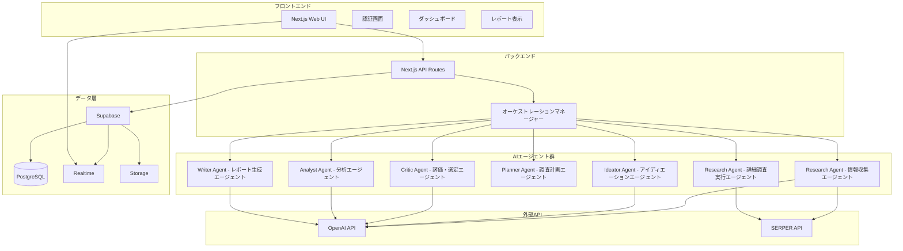
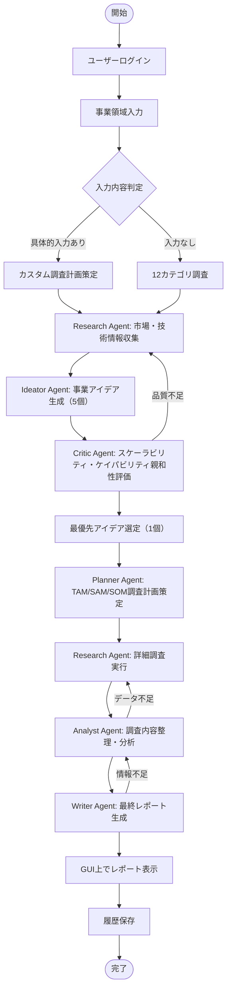

# ビジネス提案エージェント要件定義書（MVP版）

## 1. 概要

### システム構成図



### 背景

三菱地所の新事業開発部門では、事業アイデアの発掘・評価・企画において、以下の課題が存在する：

- **時間とリソースの課題**: 市場調査から事業企画まで多大な時間とリソースが必要
- **アイデア創出の困難**: 体系的な事業アイデアの創出が困難
- **レポート作成の負荷**: 事業提案レポート作成に時間がかかる

これらの課題を解決するため、AIエージェント技術を活用したMVPシステムの構築が必要となった。本システムにより、15分以内で初期アイデア生成から最終レポート出力まで一貫した支援を実現する。

### 用語定義（Glossary）

| 用語 | 定義 |
|------|------|
| エージェント | 特定の機能を持つAIモジュール |
| ケイパビリティ | 三菱地所のコア能力（不動産開発力・運営管理力・金融投資力・イノベーション力） |
| TAM | 総獲得可能市場（Total Addressable Market） |
| SAM | 獲得可能市場（Serviceable Addressable Market） |
| SOM | 実獲得可能市場（Serviceable Obtainable Market） |
| Research Agent | 市場・技術情報収集を担当するエージェント |
| Ideator Agent | 事業アイデア生成を担当するエージェント |
| Critic Agent | アイデア評価・選定を担当するエージェント |
| Planner Agent | 詳細調査計画策定を担当するエージェント |
| Analyst Agent | 調査データ分析・整理を担当するエージェント |
| Writer Agent | 最終レポート生成を担当するエージェント |
| SERPER API | Web検索機能を提供する外部API |
| Supabase | PostgreSQLベースのクラウドデータベースサービス |

## 2. 業務要件

### 業務フロー



### エージェント実行順序

**基本フロー:**
1. **Research Agent** - 市場トレンド幅広く情報収集
2. **Ideator Agent** - ビジネスアイデアを5個生成
3. **Critic Agent** - スケーラビリティおよびケイパビリティ親和性評価により1つのアイデアを選定
4. **Planner Agent** - 選定された事業アイデアのTAM、SAM、SOMや競合プレーヤーなどの調査計画を立てる
5. **Research Agent** - 調査計画に基づいて調査を実行
6. **Analyst Agent** - 調査内容を整理・分析
7. **Writer Agent** - 最終レポートを生成

**自律的判断機能:**
- 状況に応じた再調査の自動判断
- エージェント間の動的な連携
- 品質基準に基づく自動的なフィードバックループ

### 規模（スケール）

- **対象ユーザー**: 三菱地所新事業開発部門 2-3名
- **同時利用者数**: 最大3名
- **1日あたり処理件数**: 最大10件
- **年間想定利用回数**: 約100回
- **データ保存期間**: 1年間
- **想定データ量**: 年間約1GB（レポート、調査データ含む）
- **ピーク時間帯**: 平日9:00-18:00

### 時期・時間（スケジュール）

- **システム稼働時間**: 平日9:00-18:00（営業時間内）
- **処理時間制限**: 15分以内（初期アイデア生成から最終レポート出力まで）
- **各エージェント処理時間**: 3分以内
- **UI応答時間**: 3秒以内
- **レポート生成時間**: 5分以内
- **メンテナンス時間**: 必要に応じて実施

### 指標（KPI／評価基準）

- **システム稼働率**: 90%以上
- **処理成功率**: 80%以上
- **処理時間達成率**: 70%以上（15分以内完了）
- **月間利用回数**: 10回以上

### 範囲（スコープ）

- **対象事業領域**: 全領域
- **市場規模対象**: 1000億円以上の市場
- **収益目標**: 営業利益10億円（5-10年での達成）
- **地理的範囲**: 主に日本市場
- **利用制限**: 三菱地所内部利用のみ

## 3. 機能要件

### Web画面でのレポート表示機能

**背景:**
Web画面上でレポートを直接表示・再表示できる機能が必要。これにより、ユーザーはブラウザ上で即座にレポート内容を確認でき、過去のレポートも簡単に再表示できる。

**主要機能:**
- **レポート表示**: 生成完了と同時にWeb画面上でレポートを表示
- **過去レポート再表示**: 履歴から選択したレポートをWeb画面上で再表示
- **基本的な表示**: レポート内容の読みやすい表示
- **レスポンシブ対応**: PC・タブレットでの最適表示

### 機能一覧（MVP版）

| 大分類 | 機能 | 説明 |
|--------|------|------|
| ユーザー管理 | ログイン・ログアウト | Supabase Authを使用したユーザー認証 |
| Research Agent | 市場情報収集 | SERPER APIを活用した市場情報収集 |
| Ideator Agent | 事業アイデア生成 | 収益性の高い事業アイデア5個を創出 |
| Critic Agent | アイデア評価・選定 | 5個のアイデアから1個の最優先アイデア選定 |
| Planner Agent | 調査計画策定 | 市場規模調査の詳細計画策定 |
| Analyst Agent | データ分析 | 収集データの構造化と分析 |
| Writer Agent | レポート生成 | 経営層向け事業提案レポートの生成 |
| UI/UX | レポート表示 | 生成されたレポートのWeb画面上での表示 |
| UI/UX | 履歴管理 | 過去のレポート履歴の表示 |
| UI/UX | 進捗表示 | 各エージェントの処理状況表示 |

### 画面仕様（画面一覧と遷移）

#### 画面一覧

| 画面ID | 画面名 | 目的・役割 |
|--------|--------|-----------|
| SCR001 | ログイン画面 | Supabase Authによるユーザー認証 |
| SCR002 | ダッシュボード | システムの起点、調査開始と履歴表示 |
| SCR003 | 事業領域入力画面 | ユーザーの事業領域入力受付 |
| SCR004 | 進捗表示画面 | 各エージェントの処理状況表示 |
| SCR005 | レポート表示画面 | 最終事業提案レポートのGUI上での表示と再表示 |
| SCR006 | 履歴管理画面 | 過去の調査履歴の表示 |

#### 画面遷移図

```mermaid
flowchart TD
    LOGIN[SCR001: ログイン画面] --> DASH[SCR002: ダッシュボード]
    DASH --> INPUT[SCR003: 事業領域入力画面]
    DASH --> HISTORY[SCR006: 履歴管理画面]
    
    INPUT --> PROGRESS[SCR004: 進捗表示画面]
    PROGRESS --> REPORT[SCR005: レポート表示画面]
    
    HISTORY --> REPORT
    REPORT --> DASH
    
    %% GUI上でのレポート再表示
    REPORT --> REPORT : レポート再表示
```

### 情報・データ・ログ

#### データモデル（MVP版）

| テーブル名 | 項目名 | 型 | 制約 |
|-----------|--------|----|----- |
| users | id | UUID | 主キー |
| users | email | TEXT | 必須、一意制約 |
| users | name | TEXT | 必須 |
| users | created_at | TIMESTAMP | 必須 |
| sessions | id | UUID | 主キー |
| sessions | user_id | UUID | 外部キー(users.id) |
| sessions | user_input | TEXT | - |
| sessions | status | TEXT | 必須 |
| sessions | created_at | TIMESTAMP | 必須 |
| final_reports | id | UUID | 主キー |
| final_reports | session_id | UUID | 外部キー(sessions.id) |
| final_reports | report_content | JSONB | 必須 |
| final_reports | created_at | TIMESTAMP | 必須 |

#### シンプルデータ管理方式（MVP版）

**メモリベース（処理中）:**
- エージェント間の中間データ受け渡し
- 一時的な市場調査データ
- 処理中の分析結果

**Supabaseベース（永続化）:**
- セッション情報
- 最終レポート

#### データフロー（MVP版）
1. **ユーザー入力** → sessions テーブルに保存
2. **全エージェント処理** → メモリコンテキストで処理
3. **最終レポート** → final_reports テーブルに保存
4. **セッション完了** → メモリ自動クリーンアップ

#### ログ要件（MVP版）
- **基本ログ**: エラー情報、処理結果
- **保持期間**: 3ヶ月間

#### エラーハンドリング要件（MVP版）
- **エラー表示**: エラーが発生した場合は、ユーザーに明確にエラーメッセージを表示
- **エラー隠蔽の禁止**: デフォルト値やモックデータでエラーを隠蔽しない
- **エラー詳細**: 技術的なエラー詳細をログに記録し、ユーザーには分かりやすいメッセージを表示
- **処理継続**: 可能な限り処理を継続し、部分的な結果でもユーザーに提供
- **エラー分類**: API障害、データ品質問題、処理時間超過、システムエラーを明確に分類

### 外部インターフェース

#### インターフェース一覧

| インターフェース名 | 接続先 | 目的 | 備考 |
|------------------|--------|------|------|
| OpenAI API | OpenAI | AI処理（アイデア生成、評価、レポート生成） | REST API、JSON形式 |
| SERPER API | SERPER | Web検索・市場情報収集 | REST API、JSON形式 |
| Supabase Auth | Supabase | ユーザー認証・認可 | JWT認証 |
| Supabase Database | Supabase | データ永続化 | PostgreSQL、リアルタイム機能 |
| Supabase Storage | Supabase | PDFファイル保存 | オブジェクトストレージ |

#### 連携仕様詳細

**OpenAI API連携**
- **認証方式**: API Key（Bearer Token）
- **データ形式**: JSON
- **通信方式**: HTTPS
- **主要エンドポイント**: `/v1/chat/completions` (GPT-4o-mini)
- **エラーハンドリング**: レート制限時の指数バックオフ、API障害時のエラーログ記録

**SERPER API連携**
- **認証方式**: API Key（Header）
- **データ形式**: JSON
- **通信方式**: HTTPS
- **主要エンドポイント**: `/search` (Web検索)
- **エラーハンドリング**: 検索結果なし時の代替キーワード検索、キャッシュデータ活用

## 4. 非機能要件

### ユーザビリティおよびアクセシビリティ

- **直感的なUI設計**: 操作習得時間10分以内
- **レスポンシブデザイン**: PC、タブレット、スマートフォン対応
- **WCAG 2.1 AA準拠**: アクセシビリティ標準への準拠
- **多言語対応**: 日本語
- **エラーメッセージの分かりやすさ**: 具体的で理解しやすいメッセージ表示

### システム方式（アーキテクチャ）

- **フロントエンド**: Next.js、React、TypeScript
- **バックエンド**: Next.js API Routes
- **データベース**: Supabase（PostgreSQL）
- **認証**: Supabase Auth
- **AI処理**: OpenAI API（GPT-4o-mini）
- **外部API**: SERPER API（Web検索）
- **ホスティング**: Vercel

### 規模（スケーラビリティの基礎）

- **同時利用者数**: 最大3名
- **データ量**: 年間1GB
- **API呼び出し**: 月間50回
- **ストレージ**: 初期1GB
- **メモリ使用量**: サーバー当たり2GB以内

### 性能（パフォーマンス）

- **システム全体処理時間**: 15分以内
- **各エージェント応答時間**: 3分以内
- **UI応答時間**: 3秒以内
- **レポート生成時間**: 5分以内
- **ページ読み込み時間**: 5秒以内

### 信頼性（安定稼働・可用性）

- **システム稼働率**: 95%以上
- **障害復旧時間**: 4時間以内
- **データバックアップ**: Supabaseの自動バックアップ機能を利用

### 拡張性

- **モジュラー設計**: 将来的な機能追加に対応
- **設定ベース**: 基本設定の変更可能

## 5. セキュリティー要件

### 情報セキュリティ

- **認証・認可**: Supabase Authによるユーザー認証
- **APIキー管理**: 環境変数での安全な管理
- **基本的なアクセス制御**: 認証済みユーザーのみアクセス可能

### 稼働環境

- **対応ブラウザ**: Chrome、Firefox、Safari、Edge（最新版）
- **ネットワーク**: HTTPS必須
- **画面解像度**: 1024x768以上
- **JavaScript**: 有効化必須
- **Cookie**: 有効化必須（認証用）

### テスト（品質保証）

- **基本機能テスト**: 主要機能の動作確認
- **認証テスト**: ログイン・ログアウト機能のテスト
- **統合テスト**: エージェント間の連携テスト

